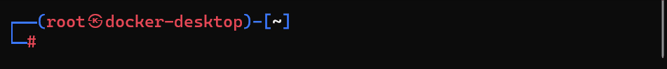

# Project 3 - Kali

Time spent: 2 hours spent in total


Open terminal and go to the desired folder run git clone to get the package that we need to complete week 3 and week 7 assignment.

After the clone, there is a folder created with name wpVSkali To navigate to wpVSkali run: cd wpVSkali

Run the build command to build an image/images from a Dockerfile

Ignore the docker scan response, we are not going to use at this time.

Use 'docker scan' to run Snyk tests against images to find vulnerabilities and learn how to fix them
Make WPFLODER for future use, you can skip the step for now, needed on Unit 7:mkdir wpFolder

Run Docker ps -a to Show all containers (default shows just running)

You will see an image with the name kaliCP. We'll need start Kali interactive mode: docker exec -it kaliCP bash

Verify Kali os-release information: cat /etc/os-release

```bash
name="FirstName LastName"
univ="University of Science"

screenfetch
echo $name'@'$univ
```

Save the file as **screenfetch.gif**.

**Challenges and Problems**: 

### Running screenfetch (PUT YOUR GIF BELOW)


